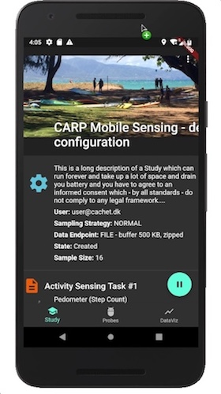
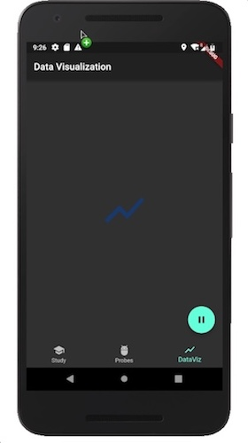
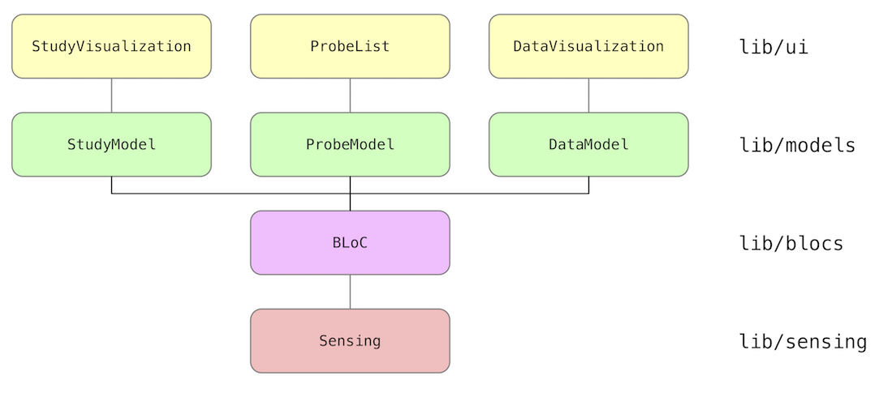

# CARP Mobile Sensing App

The CARP Mobile Sensing App provides an example on how to use the [`carp_mobile_sensing`](https://pub.dartlang.org/packages/carp_mobile_sensing) package.
The app sets up a `Study` that starts a set of `Probe`s and visualize the data. The UI of the app is shown below, showing
(from left to right) the Study Visualization page, the Probe List page, and the Data Visualization page (the latter is not implemented yet).

 
 
 


The architecture of the app is illustrated below. It follows the [BLoC architecture](https://medium.com/flutterpub/architecting-your-flutter-project-bd04e144a8f1),
which is recommended by the [Flutter Team](https://www.youtube.com/watch?v=PLHln7wHgPE).




The basic architecture holds a singleton `Sensing` class responsible for handling sensing via the [`carp_mobile_sensing`](https://pub.dartlang.org/packages/carp_mobile_sensing) package. 
All data is handled by a singleton `BloC` which is the only way, the UI models can access and modify 
data, or initiate life cycle events (like pausing and resuming sensing). 
All data to be shown in the UI are handled by (UI) models, and finally each screen (`Widget`)
is implemented as a [`StatefulWidget`](https://docs.flutter.io/flutter/widgets/StatefulWidget-class.html)
in Flutter. Each UI widget only known its corresponding model
and the model knows the BloC. **NO** data or control flows between the UI and the Bloc or Sensing layer.

## Sensing BLoC

Since the BLoC is the controller of the entire app, lets start with this class.

````dart
class SensingBLoC {
  final Sensing sensing = Sensing();

  /// Is sensing running, i.e. has the study executor been resumed?
  bool get isRunning => (sensing.controller != null) ? sensing.controller.executor.state == ProbeState.resumed : false;

  /// Get the study for this app.
  StudyModel get study => sensing.study != null ? StudyModel(sensing.study) : null;

  /// Get a list of running probes
  Iterable<ProbeModel> get runningProbes => sensing.runningProbes.map((probe) => ProbeModel(probe));

  /// Get the data model for this study.
  DataModel get data => null;

  void init() async {}

  void start() async => await sensing.start();

  void pause() => sensing.controller.pause();

  void resume() async => sensing.controller.resume();

  void stop() async => sensing.stop();

  void dispose() async => sensing.stop();
}

final bloc = SensingBLoC();
````

The BLoC basically plays two roles; it access data by returning model objects (such as `StudyModel`) 
and it expose business logic like the sensing life cycle events (`start`, `stop`, etc.).
Note that the singleton `bloc` variable is created, which makes the BLoC accessible in the entire app.

We will not discuss the [`Sensing`](https://github.com/cph-cachet/carp.sensing-flutter/blob/master/carp_mobile_sensing_app/lib/src/sensing/sensing.dart) 
class here. I basically implements a [`Study`](https://pub.dartlang.org/documentation/carp_mobile_sensing/latest/core/Study-class.html) and sets up the sensing according to the
[documentation](https://github.com/cph-cachet/carp.sensing-flutter/wiki) of the [`carp_mobile_sensing`](https://pub.dartlang.org/packages/carp_mobile_sensing) package.

 ## UI Models
 
 In this CAPR Mobile Sensing App, we use one UI Model for each UI Widget. 
 For example, the UI Model `StudyModel` serves the UI Widget `StudyVisualization`.
 The main reposibility of the UI Model is to provide access to data (both getter and setters), 
 which is done via the BLoC.

The `StudyModel` class looks like this:

`````dart
class StudyModel {
  Study study;

  String get name => study.name;
  String get description => study.description ?? 'No description available.';
  Image get image => Image.asset('images/study.png');
  String get userID => study.userId;
  String get samplingStrategy => study.samplingStrategy.toString();
  String get dataEndpoint => study.dataEndPoint.toString();

  /// Events on the state of the study executor
  Stream<ProbeState> get studyExecutorStateEvents => bloc.sensing.controller.executor.stateEvents;

  /// Current state of the study executor (e.g., resumed, paused, ...)
  ProbeState get studyState => bloc.sensing.controller.executor.state;

  /// Get all sesing events (i.e. all [Datum] objects being collected).
  Stream<Datum> get samplingEvents => bloc.sensing.controller.events;

  /// The total sampling size so far since this study was started.
  int get samplingSize => bloc.sensing.controller.samplingSize;

  StudyModel(this.study)
      : assert(study != null, 'A StudyModel must be initialized with a real Study.'),
        super();
}
`````

In this model, there are only data **getters**, since in the current version of the app, you 
cannot change a study once it is running. However, if modification of a study was to be 
supported, then **setter** methods would be implmented in the model as well. 
For example, the following method would enable modification of the study name.

````dart
void set name(String name) {
  ...
}
````

## UI Widgets

The final layer is the UI widgets. 
Each UI widget takes in its constructor its corresponding UI model. 
For example, the `StudyVisualization` widget's `State` takes a `StudyModel` in its constructor:

`````dart
class StudyVisualization extends StatefulWidget {
  const StudyVisualization({Key key}) : super(key: key);

  _StudyVizState createState() => _StudyVizState(bloc.study);
}

class _StudyVizState extends State<StudyVisualization> {
  final StudyModel study;

  _StudyVizState(this.study) : super();

  @override
  Widget build(BuildContext context) {
    ... 
  }
}
`````

In this way, the `study` is available in the entire UI Widget. 
This allow us to access data and show it in the UI. For example, to show the study name and image, 
this code is used:

````dart
 FlexibleSpaceBar(
    title: Text(study.name),
    background: Stack(
      fit: StackFit.expand,
      children: <Widget>[
        study.image,
      ],
    ),
 ),

````

More sophisticated (reactive) UI implementation can also be done. For example, to show the
counter showing sampling size, the following `StreamBuilder` is used.

`````dart
 StreamBuilder<Datum>(
    stream: study.samplingEvents,
    builder: (context, AsyncSnapshot<Datum> snapshot) {
      return Text('Sample Size: ${study.samplingSize}');
    })
`````

